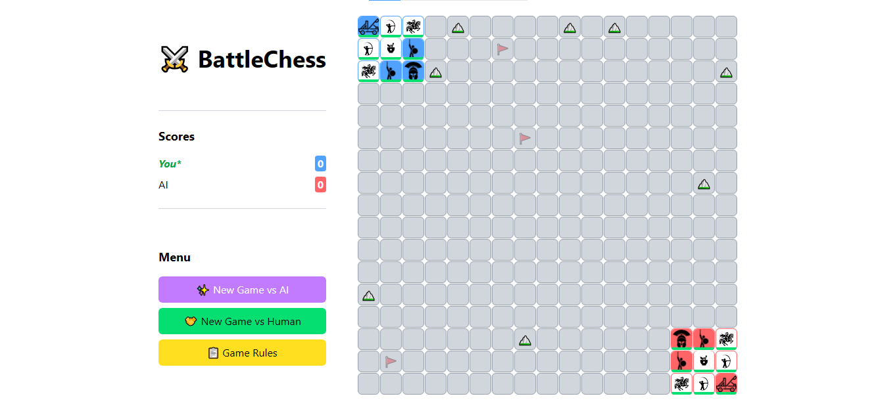

# BattleChess AI

### Screenshot

### Features
- Play against AI or pass and play with your friend
- The goal is to control all checkpoints OR kill all enemy units
- Units have different health, movement, damage and range
- Knights and Siege Weapons can move two steps in a move
- Mountains act as obstacles but some units can cross it

### Made using:
- React
- Tailwind
- AI concepts: Minimax and Alpha-Beta Pruning